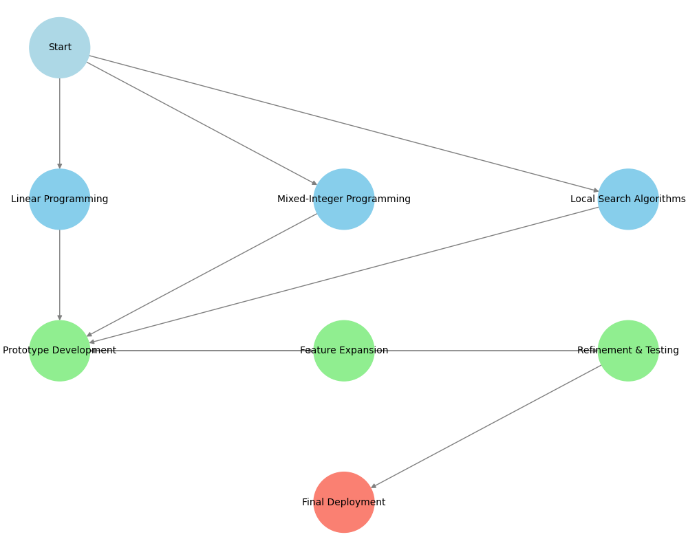
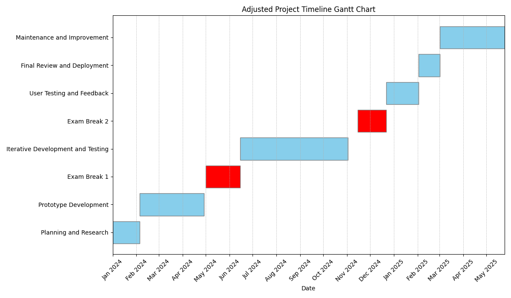

# Project Development Plan

## Overview
This document outlines the development phases of the scheduling system project, focusing on a user-friendly, hybrid system compatible with a Django web application backend. The code is documented using Doxygen (see docs/). 

 

## Phases of Development

### Phase 1: Planning and Research
**Duration:** 5 weeks

**Objectives:**
- Understand the scheduling problem in depth.
- Research existing solutions, frameworks, and methodologies.

**Tasks:**
- **Explore the Problem**: Define the requirements and constraints of the scheduling system.
- **Literature Review**: Conduct a review of similar problems and solutions.
- **Technology Selection**: Choose appropriate technologies considering integration with Django.
    - **Programming Language**: Python
    - **Solver Options**: Pyomo, PuLP for linear/mixed-integer programming; explore Julia's JuMP for more complex formulations.
    - **Web Framework**: Django for backend integration.
- **Initial Design**: High-level design of the system, considering a hybrid model for both automated and manual scheduling.

---

### Phase 2: Prototype Development
**Duration:** 12 weeks

**Objectives:**
- Develop a basic, functional prototype.
- Establish core functionalities.

**Tasks:**
- **Excel Integration**: Implement functionality to read Excel files (using `pandas`).
- **Solver Implementation**: Basic implementation of scheduling algorithms using chosen solvers.
- **GUI Development**: Develop a simple and intuitive web interface (considering Django-compatible JavaScript frameworks like React or Vue.js for front-end).
- **Initial Testing**: Basic functionality and usability testing.

---

### Phase 3: Exam Break
**Duration:** Adjusted as per academic schedule

**Objectives:**
- Focus on academic commitments, with minimal engagement in the project.

---

### Phase 4: Iterative Development and Testing
**Duration:** 16 weeks

**Objectives:**
- Enhance, refine, and optimize the system.
- Focus on robustness, efficiency, and user experience.

**Tasks:**
- **Feature Expansion**: Integrate advanced features and constraints.
- **Optimization**: Enhance the efficiency of the scheduling algorithm.
- **GUI Improvement**: Improve the web interface for better user interaction (using Django with JavaScript frameworks).
- **Comprehensive Testing**: Conduct extensive testing, including user acceptance testing.

---

### Phase 5: User Testing and Feedback
**Duration:** 6 weeks

**Objectives:**
- Gather and incorporate user feedback.
- Refine the system based on real-world usage.

**Tasks:**
- **User Testing**: Deploy the system for controlled user testing.
- **Feedback Collection**: Gather user feedback, focusing on usability and functionality.
- **Iterative Improvements**: Refine the system based on feedback, ensuring simplicity and effectiveness.

---

### Phase 6: Final Review and Deployment
**Duration:** 4 weeks

**Objectives:**
- Finalize the system for operational deployment.
- Ensure the system is user-friendly and integrates seamlessly with the existing infrastructure.

**Tasks:**
- **Final Refinements**: Implement the final set of refinements.
- **Documentation**: Complete comprehensive documentation for users and maintainers.
- **Deployment Preparation**: Prepare the system for full deployment in the Django-based web environment.
- **Final Review**: Review the system with stakeholders for final approval.

---

### Phase 7: Maintenance and Improvement
**Duration:** Ongoing

**Objectives:**
- Maintain the system's functionality and relevance.
- Continuously improve based on user feedback and technological advancements.

**Tasks:**
- **Regular Updates**: Implement updates to maintain compatibility with Django and other technologies.
- **Feedback Monitoring**: Monitor and respond to user feedback for ongoing improvements.
- **Adaptation to Changes**: Adapt the system to evolving requirements and technological changes.

---

This plan is designed to ensure a systematic, efficient approach to developing a user-friendly, hybrid scheduling system, integrated with a Django-based web application.

